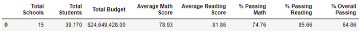
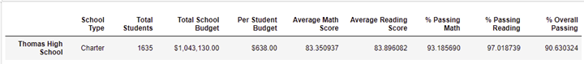
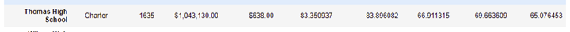
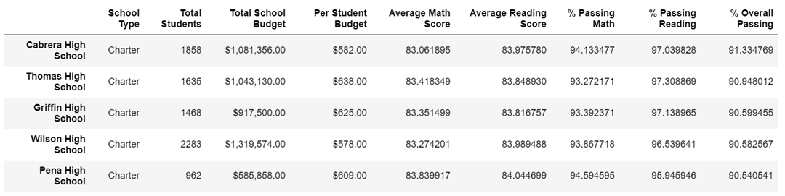
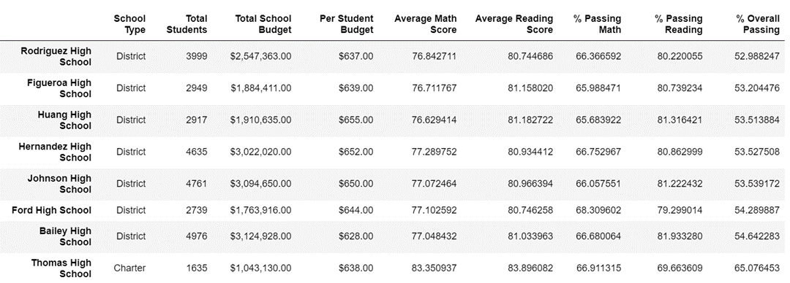
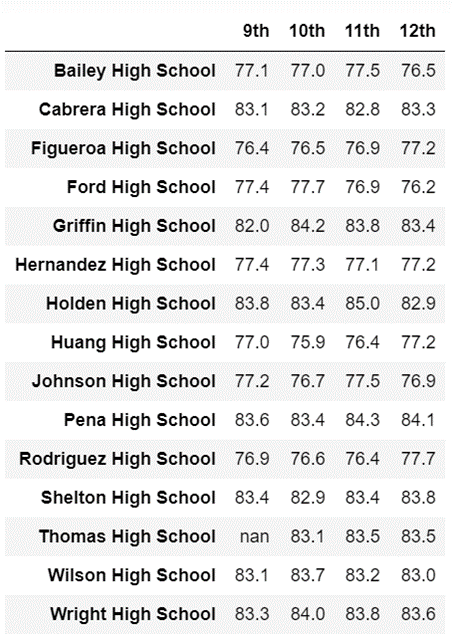
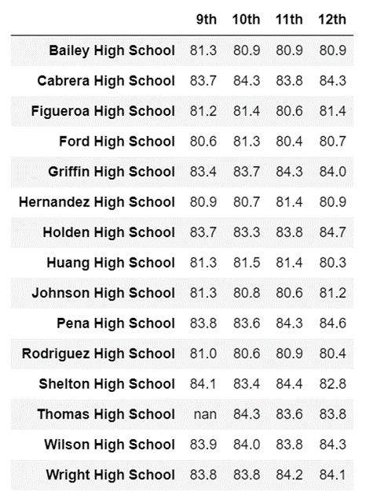
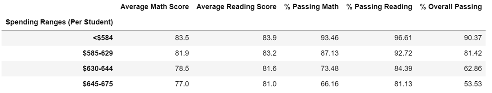
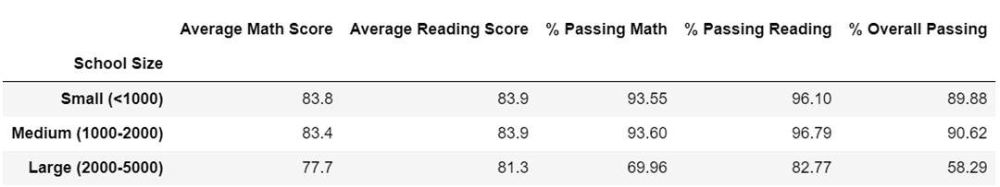
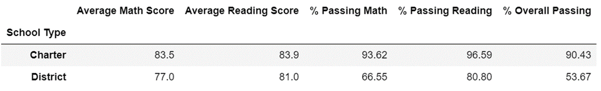

# School_District_Analysis2
##Overview of the school district analysis: 
The school board is planning for the next school years budget and wanted to make sure that the School District were providing funds appropriately for each school. Also, the data scientist was tasked to analyze the standardized test on each school’s performance by the district level. The main focus of this analysis are on the math and reading performance/scores. When the school board is reviewing the data, they suspected a possible cheating/dishonesty among the 9th graders at Thomas High School. In this regard, the school board decided to remove and analyzed again for comparison.
##Resources
Resources: All data used in this analysis is found inside of the Resources folder.
Software: Python 3.7, Anaconda, Jupyter Notebook
##Results: Using bulleted lists and images of DataFrames as support, address the following questions.

o	How is the district summary affected? 
Though 461 student’s grades were flagged as “null” the overall data did not change as the report were run by student ID which were not turned out as null and not by grades
 

o	How is the school summary affected? 
The overall passing rate went down from 90.94% to 65.08%

 o	How does replacing the ninth graders’ math and reading scores affect Thomas High School’s performance relative to the other schools?
Thomas HS went from second (2nd) rank to eighth (8th) as a result 
 
 
 
o	How does replacing the ninth-grade scores affect the following: Math and reading scores by grade
The original analysis, for  Thomas High School had 83.6 math average and 83.7 reading average for the 9th grade tests respectively. Now the scores have been replaced with null values and shows up in Python programming as NaN in the following charts.

  
  
	Scores by school spending
Thomas HS is within the $630-$644 per student spending range. The 9th grade scores did not make a big impact 
 
	Scores by school size -THS is considered as medium sized school 
  
	Scores by school type
  
## Summary: Summarize four changes in the updated school district analysis after reading and math scores for the ninth grade at Thomas High School have been replaced with NaNs.
### a.	The overall passing rate for Thomas High School dramatically changed from 91% to 65%.
### b.	Thomas High School's ranking dropped from 2nd to 8th in the district of 15 school.
### c.	Data at the grade level will now show as "NaN" in reports for the 9th grade students at Thomas High School. Some reports have a minor impact that were insignificant, but some were major 
### d.	The overall passing rate, the math and reading averages and passing percentages all changed.
